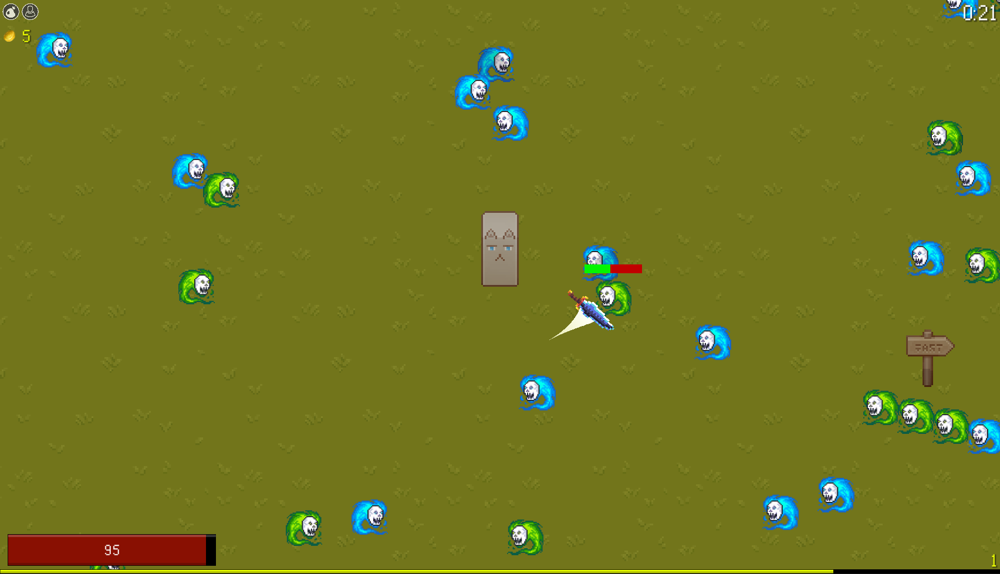
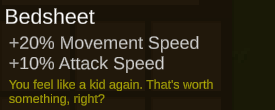

*Most assets were temporary and downloaded for free from the Unity asset store.*

Relm is a vertical slice of a 'Vampire Survivor'-esque game. You defeat monsters, level up, collect equipment, and try to survive as long as possible. The design is limited with things like balance and variety not existing at all. Just a fun little demo.

All enemies have a chance to drop items which can then be equipped to improve your character. The inventory is resizable and searchable, and items have descriptive tooltips.

When your character levels up, you are given a choice of 5 different upgrades to pick. These upgrades are pulled from a pool and guarantees at least one offensive, defensive, and utility upgrade.

If you are getting unlucky with item drops, there is a shop that you can spend gold at to reliably purchase upgrades.

There is a character panel that lets you quickly check what your stats look like. This takes into account level up rewards, as well as any equipment you have equipped.

Lastly there exists a console that aided in development. It features intelligent autocomplete and syntax recommendations, such as listing all spawnable items when previewing the item command.

